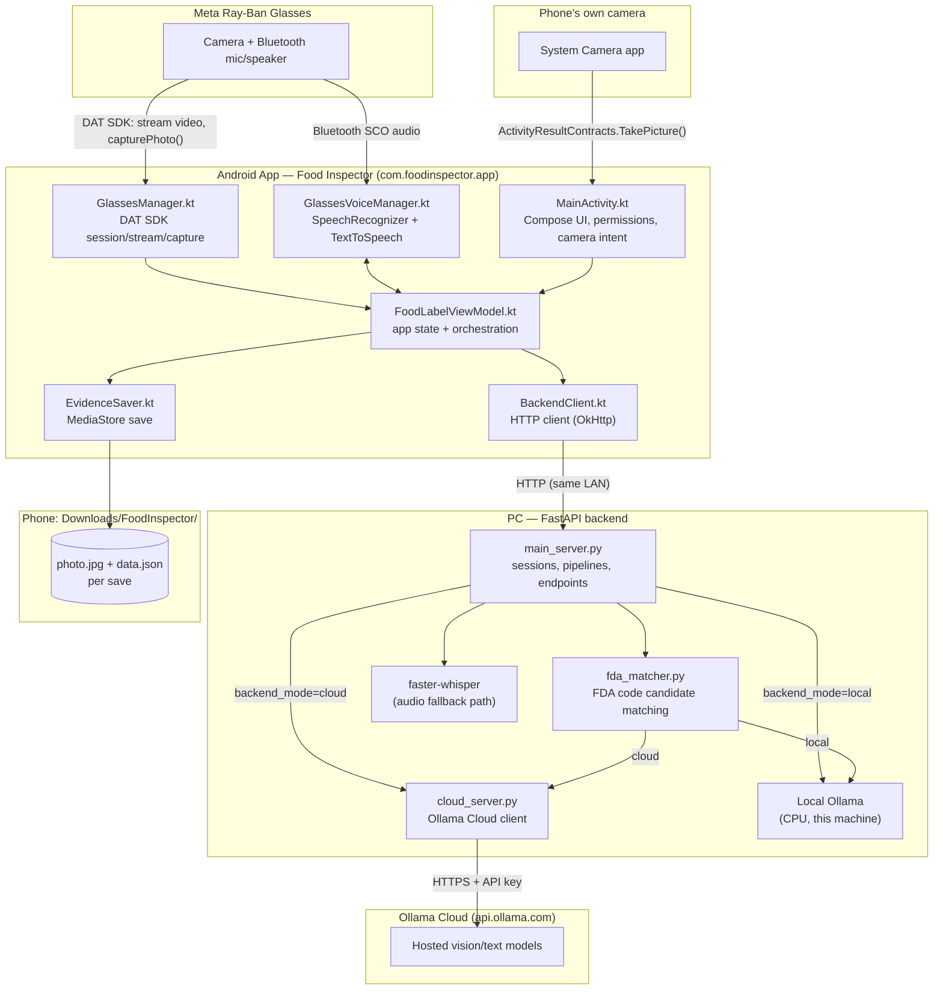
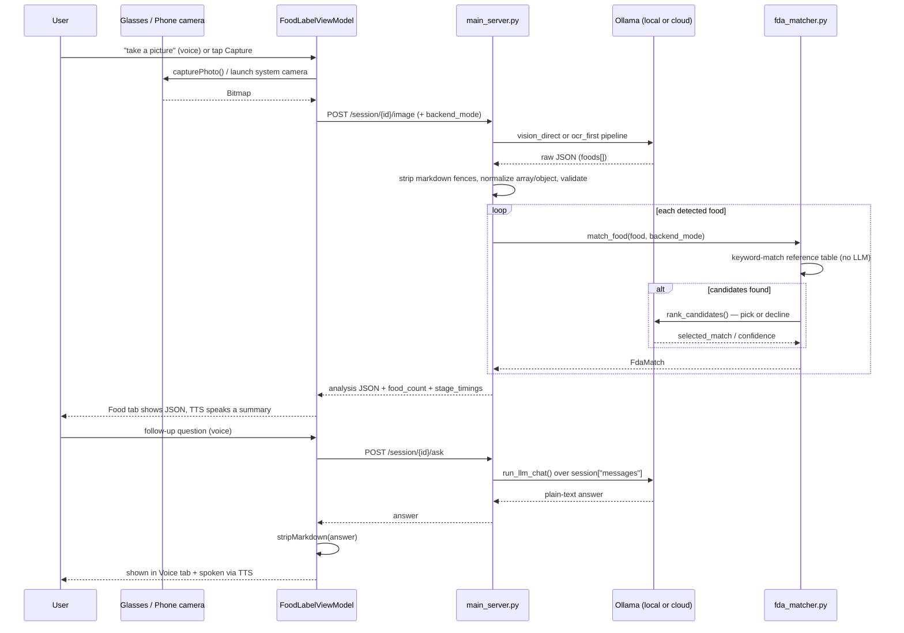

# Food Inspector

Android app (in-app display name **"Food Inspector"**, package `com.foodinspector.app`) that
turns Meta Ray-Ban smart glasses — or your phone's own camera — into a hands-free food-label
scanner, backed by a local FastAPI + Ollama server on your PC (with an optional Ollama Cloud
fallback).

Point the glasses (or your phone) at a food label, say "take a picture," and get back a
structured breakdown of every product in frame — ingredients, allergens, nutrition claims, and
a best-effort FDA product-code match — then keep asking follow-up questions by voice, entirely
hands-free.

## Architecture



### Capture -> analyze -> voice, end to end



## What this app does

1. **Connect** to Meta Ray-Ban glasses over the Device Access Toolkit (DAT) SDK, or skip the
   glasses entirely and use the phone's own camera.
2. **Capture** a photo (glasses shutter, phone camera, or a spoken trigger phrase) and send it
   to a **FastAPI backend on your PC**, which runs it through a local Ollama vision model (or,
   optionally, a hosted Ollama Cloud model) to extract structured per-product data: name,
   brand, ingredients, allergens, nutrition claims, and a best-effort **FDA product code**
   candidate match.
3. **Ask follow-up questions by voice**, hands-free — the app listens continuously, answers,
   and starts listening again automatically, no button needed.
4. **Save** the current photo + analysis + conversation locally (voice command or a menu tap) —
   lands in your phone's visible Downloads folder.
5. Switch between **local** (your PC's Ollama, CPU) and **Ollama Cloud** (hosted models) with
   one toggle, per request.

## Features in detail

### Glasses connection (DAT SDK 0.9.0)
`GlassesManager.kt` wraps the Meta DAT session/camera API:
`Wearables.initialize` -> `startRegistration` -> `checkPermissionStatus`/`RequestPermissionContract`
-> `createSession` -> `DeviceSession.addCamera` -> `Camera.stream`. A live preview
(`TextureView`, raw YUV frames — `compressVideo=false`) confirms streaming is actually
happening. `capturePhoto()` calls the SDK's `stream.capturePhoto()` directly and falls back to
the latest cached preview frame if the hardware shutter fails/times out.

### Phone camera capture (no glasses needed)
The camera icon in the bottom row launches the **system Camera app**
(`ActivityResultContracts.TakePicture()`, full resolution, via a `FileProvider`-issued
`content://` Uri into a cache-dir temp file). The resulting Bitmap goes through the exact same
`uploadAndAnalyze()` path a glasses capture uses — same backend call, same resulting state,
just a different source label.

### Local vs. Ollama Cloud toggle
A single `cloudMode` flag (Settings screen) is sent as `backend_mode` on every image/ask
request. Local mode runs a CPU-bound Ollama instance on your PC (see Pipeline modes below);
Cloud mode calls **Ollama Cloud** via `cloud_server.py` using an API key you configure. Cloud
uses the **original, uncompressed** upload (no resize/recompress — that's a CPU-latency
mitigation that doesn't apply to a hosted GPU) while local mode uses the resized/recompressed
JPEG.

### Hands-free voice mode
`GlassesVoiceManager.kt` uses Android's on-device `SpeechRecognizer` (not a manual
record-then-upload) — it ends each utterance on natural silence (VAD), so there's no "stop
recording" step. `FoodLabelViewModel` drives a continuous
`listenOnce() -> handleVoiceCommand() -> speakThenListen() -> listenOnce()` loop while voice
mode is on. Every recognized transcript is checked against fixed phrase lists, in this order,
before falling through to "ask the LLM a question":

| Trigger phrases (case-insensitive substring match) | Action |
|---|---|
| "take a picture", "take a photo", "take a snapshot", "analyze this", "capture" | Capture + analyze (glasses) |
| "save it", "save", "store", "copy", "keep evidence" | Save photo + analysis + conversation locally |
| "stop voice mode", "stop voice", "turn off voice mode", "turn off voice", "pause voice" | Turn voice mode off |
| "stop glasses", "turn off glasses", "turn off glass", "disconnect glasses", "disconnect", "pause video", "pause image" | Disconnect glasses (voice mode keeps listening) |
| *(anything else)* | Sent to the backend as a question (`/session/{id}/ask`) |

LLM answers are run through `stripMarkdown()` before being shown or spoken, since local models
sometimes wrap words in `**bold**`/`` `code` `` even when the system prompt says not to — this
strips the formatting markers while keeping the actual text (`**95**` -> `95`).

### Local save ("evidence")
`EvidenceSaver.kt` writes the current photo (`photo.jpg`) and a JSON bundle (`data.json`:
timestamp, analysis, full Q&A history since the last capture) via `MediaStore.Downloads` —
lands in **Downloads/FoodInspector/evidence_&lt;timestamp&gt;/**, visible in any file manager,
no storage permission needed (MediaStore insert of your own app's entries is always allowed).
Triggered by voice ("save it", etc.) or the ⋮ menu's **Save** item — both share one
`performSave()` implementation in the ViewModel; only the voice path also speaks the result.

### FDA product-code matching
Every detected food item gets an `fda_match` field:
`{selected_match, confidence, other_matches, verification_required}`. This is **grounded
candidate-generation, never invention** (see `backend/fda_matcher.py`): a small pre-approved
reference table (`backend/fda_food_codes.json`, sourced from real FDA Import Alert records) is
keyword-matched against the extracted product fields (no LLM involved in this step — instant,
zero hallucination risk); only if candidates are found does a small LLM call rank them, and the
code enforces that the model's pick is verbatim one of the offered candidates or else treats it
as no match. `verification_required` is always `true` — this is a best-effort match, not a
substitute for the official FDA Product Code Builder.

### Clear Session
The ⋮ menu's **Clear Session** resets the app to a fresh-launch state: disconnects the glasses,
stops voice mode if running, and wipes session id/analysis/food count/Q&A history/last photo/
error. Deliberately leaves the backend URL and cloud/local toggle alone (user configuration,
not session data).

### UI
A Material3 Compose UI with a custom color theme (`ui/theme/`), a hamburger-driven navigation
drawer (Settings / About, with in-app back-arrow + system-back support, and a clickable
"Food Inspector" title that always returns to the main screen), a big live preview with a red
"LIVE" badge, and a 6-icon bottom row: **Glasses**, **Voice**, **Food**, **Session Info**,
**Phone Camera**, **⋮ (Save / Send to SERIO / Clear Session)**. Tapping one of the first 4
icons shows/hides its corresponding card below (tap again to collapse); at most one is shown at
a time.

"Send to SERIO" is a **placeholder** for a future REST integration with an external app —
currently just sets a status message, no network call.

## Backend (`backend/`)

### Pipeline modes (`main_server.py`, `PIPELINE_MODE` constant)
- **`vision_direct`** (current default): the vision model sees the image directly and produces
  the full structured JSON in one call.
- **`ocr_first`**: a dedicated OCR model transcribes visible text first, then a small text model
  structures that text — cheaper on CPU since the structuring step never touches image tokens.
  Falls back to `vision_direct` automatically if the OCR pass returns under 15 characters (a
  blurry/off-angle photo can leave nothing to structure, which otherwise silently produced a
  valid-but-empty result).
- **Cloud** (`backend_mode=cloud`, independent of `PIPELINE_MODE`): a single call to
  `cloud_server.analyze_image_cloud()`.

All three paths converge on the same `MultiFoodAnalysis` pydantic schema, and all raw model
output is passed through `extract_json_payload()` -> `strip_json_code_fence()` ->
`normalize_multi_food_json()` before validation — cloud models in particular have been observed
wrapping JSON in markdown fences, adding prose around it, or returning a bare array instead of
the required `{"foods": [...]}` object; these three helpers recover all of those cases without
rejecting an otherwise-usable response.

### CPU-latency mitigations
This machine has no GPU, so every local Ollama call is CPU-bound. `OLLAMA_KEEP_ALIVE = "30m"`
keeps models resident between requests (Ollama's default unloads after ~5 min), a
`@app.on_event("startup")` handler warms up every model the active pipeline uses at boot
(instead of paying that cold-load cost on the user's first real request), and `OLLAMA_NUM_CTX`
caps context size instead of relying on a vision model's often-huge default.

### Endpoints
| Method & path | Purpose |
|---|---|
| `POST /session` | Create a session, returns `session_id` |
| `POST /session/{id}/image` | Analyze an image (`file` multipart + `backend_mode` field) |
| `POST /session/{id}/ask` | Text-only question (JSON `{question, backend_mode}`) — used by the app's on-device speech recognition |
| `POST /session/{id}/voice` | Audio-upload question (multipart `audio` + `backend_mode`) — server-side Whisper transcription; used by the browser UI and the `/glasses/voice` bridge |
| `GET /session/{id}/glasses/status`, `POST /session/{id}/glasses/command` | Lightweight bridge endpoints for a native companion app |
| `GET /health`, `GET /debug` | Machine-readable health check / human-readable diagnostics page |
| `GET /` | Minimal browser UI (upload an image, record voice) — includes the same cloud/local toggle |

### Models
- Local vision: `ministral-3:3b`. Local text: `minicpm-v4.6:1b`. Local OCR (`ocr_first` only):
  `glm-ocr:bf16`. FDA ranking: reuses `ministral-3:3b` — the local text model was empirically
  unreliable at that specific structured-output task (see `SOURCE_NOTES.md`).
- Cloud: configured in `cloud_server.py` (`CLOUD_VISION_MODEL`, `CLOUD_TEXT_MODEL`) — **you must
  set your own values and API key there**; see the setup note below.
- Whisper: `small`, CPU, int8 (audio-upload path only; the primary voice path doesn't need it).

### FDA reference table setup
`backend/fda_food_codes.json` ships with real, sourced entries for snacks, nuts, beverages,
bakery, and chocolate/candy (see file comments for each entry's source). Add more entries in
the same shape (`category`, `aliases`, `product_code`, `notes`) as you verify them against the
official FDA Product Code Builder — an empty/missing file just makes matching a safe no-op.

### ⚠️ Secrets note
`backend/cloud_server.py` ships with a placeholder (`"OLLAMA API KEY"`), not a real key.
Prefer setting the `OLLAMA_API_KEY` environment variable (checked first) over editing
`OLLAMA_CLOUD_API_KEY` in the file directly — that way there's no key to accidentally commit.

## Code workflow / main functions

### Android (`app/src/main/java/com/foodinspector/app/`)

**`MainActivity.kt`** — Activity + all Compose UI.
- `onCreate` — permissions, `vm.initializeGlasses()`, sets Compose content.
- `onCameraIconClicked()` / `launchPhoneCamera()` — CAMERA permission request +
  `ActivityResultContracts.TakePicture()` launch via a `FileProvider` Uri.
- `FoodLabelScreen` — top-level Composable: nav drawer, top bar (hamburger/back + clickable
  logo title), routes to `SettingsScreen`/`AboutScreen`/`MainScreenContent` by a local
  `DrawerScreen` enum.
- `MainScreenContent` — live preview, `BottomIconRow`, and whichever card matches
  `selectedTab` (a local `BottomTab?` enum — `null` means no card shown).
- `SettingsScreen` — debounced backend-URL apply (`LaunchedEffect` + `delay(600)`), inline
  validation, brief grey-out overlay while applying.

**`FoodLabelViewModel.kt`** — all app state (`AppUiState`) and orchestration logic.
- `captureAndAnalyze()` / `performCaptureAndAnalyze()` — manual/voice glasses capture.
- `analyzePhoneCameraPhoto(bitmap)` — phone-camera capture entry point.
- `uploadAndAnalyze(bitmap, sessionId, source)` — shared by both capture sources: POSTs to the
  backend, applies the resulting analysis state, records `lastPhoto` (used by Save).
- `toggleVoiceMode()` / `startVoiceMode()` / `stopVoiceMode()` — hands-free loop on/off.
- `listenOnce()` / `handleVoiceCommand(transcript)` / `speakThenListen(text)` — the continuous
  listen -> route -> act -> speak -> listen loop; `handleVoiceCommand` is where every trigger
  phrase list (capture/save/stop-voice/stop-glasses) is checked in order.
- `performSave()` / `saveEvidence()` / `handleSaveCommand()` — shared save logic plus its
  voice (speaks result) and menu-tap (silent) entry points.
- `updateBackendUrl(url)` — validates and applies a new backend URL, resetting session state.
- `clearSession()` — resets to fresh-launch state.
- `stripMarkdown(text)` / `isValidHttpUrl(candidate)` — small top-level helper functions shared
  across the ViewModel and UI.

**`GlassesManager.kt`** — DAT SDK session/camera/capture, isolated from the rest of the app.
`startStream()`/`stopStream()` own the `DeviceSession`/`Camera` lifecycle; `capturePhoto()` is
the only capture entry point (hardware shutter, with a cached-preview-frame fallback).

**`GlassesVoiceManager.kt`** — `SpeechRecognizer` + `TextToSpeech`, including Bluetooth SCO
audio routing to/from the glasses. `startListening()`/`speak()` both await the SCO link
actually connecting before doing anything (a real bug fixed here twice — see
`SOURCE_NOTES.md`).

**`BackendClient.kt`** — thin OkHttp wrapper: `createSession()`, `analyzeImage()`,
`askQuestion()`. Failures log the full response body but throw a short message (the UI/TTS
should never read out a raw error dump).

**`EvidenceSaver.kt`** — `save()`: writes photo + JSON via `MediaStore.Downloads`.

**`ui/theme/Color.kt` / `Theme.kt`** — the custom Material3 color scheme and per-icon accent
colors.

### Backend (`backend/`)

**`main_server.py`**
- `analyze_session_image()` — the `/session/{id}/image` handler: preprocesses the upload,
  branches on `backend_mode`/`PIPELINE_MODE`, cleans and validates the model's JSON, runs FDA
  matching per food item, updates session state.
- `run_llm_chat()` — shared by `/ask` and `/voice`: appends a turn, calls local or cloud chat,
  appends the answer.
- `build_system_message()` — the per-session system prompt (includes the current image's
  structured data, and instructs the model to answer in plain text, no markdown/tables/JSON
  unless asked).
- `strip_json_code_fence()` / `extract_json_payload()` / `normalize_multi_food_json()` — the
  three-stage cleanup applied to every raw model response before schema validation.
- `_warm_up_ollama_models()` — startup model pre-warming.

**`cloud_server.py`** — `analyze_image_cloud()`, `run_llm_chat_cloud()`,
`rank_fda_match_cloud()`: same call shapes as their local counterparts, pointed at
`https://ollama.com` with your API key.

**`fda_matcher.py`** — `find_candidates()` (deterministic keyword match), `rank_candidates()`
(LLM pick, grounded to the offered list), `match_food()` (entry point, never raises).

## Setup

### Backend
1. Install [Ollama](https://ollama.com/download) and make sure it's running locally, then pull
   the local models this project uses:
   ```powershell
   ollama pull ministral-3:3b
   ollama pull minicpm-v4.6:1b
   ollama pull glm-ocr:bf16   # only needed if you switch PIPELINE_MODE to ocr_first
   ```
2. `cd backend` and install the Python dependencies (Python 3.10+ recommended; a virtualenv is
   optional but recommended):
   ```powershell
   pip install -r requirements.txt
   ```
   This installs `fastapi`, `uvicorn`, `pydantic`, `pillow`, `ollama`, `faster-whisper`, and
   `python-multipart`. `faster-whisper` will download its `small` model weights on first use.
3. (Optional, for Cloud mode) get an API key from [Ollama Cloud](https://ollama.com), then either
   set it as the `OLLAMA_API_KEY` environment variable (checked first, recommended) or edit the
   `OLLAMA_CLOUD_API_KEY` placeholder default in `cloud_server.py` directly — and set your chosen
   `CLOUD_VISION_MODEL`/`CLOUD_TEXT_MODEL` there too. See the Secrets note below before doing the
   latter.
4. (Optional, for FDA matching) populate `fda_food_codes.json` with more verified entries.
5. Run:
   ```powershell
   python -m uvicorn main_server:app --host 0.0.0.0 --port 8443
   ```
6. Verify: `http://127.0.0.1:8443/debug` (PC) and `http://<PC-LAN-IP>:8443/debug` (phone browser,
   same LAN — Windows Firewall must allow the port).

### Android app
1. Open the project root in Android Studio, let it sync.
2. The Meta DAT SDK is pulled from a GitHub Packages Maven repo (see `settings.gradle.kts`),
   which requires a GitHub personal access token with `read:packages` scope. Provide it either
   as the `GITHUB_TOKEN` environment variable, or by copying `local.properties.example` to
   `local.properties` and uncommenting/setting `github_token=YOUR_TOKEN` there (this file is
   gitignored, so it's safe to put a real token in it).
3. Update the default backend URL either in `app/build.gradle.kts` (`DEFAULT_BACKEND`) or later
   in-app via **☰ -> Settings** (auto-applies ~600ms after you stop typing a valid `http(s)`
   URL).
4. Build & install.

### Meta glasses registration
The manifest ships Developer Mode placeholders (`APPLICATION_ID`/`CLIENT_TOKEN` both `"0"`),
which skip attestation for local testing:
1. Ensure Meta AI is installed and **Developer Mode is ON for this specific glasses device**
   (Meta AI app, device settings — separate from just pairing).
2. Open the app -> ☰ -> **Glasses** tab -> **Register with Meta AI**, complete the flow, then
   **Connect**.
3. Wait for the live preview to show the red **LIVE** badge.
4. Capture via the Glasses tab's button, the phone-camera icon, or by voice.

For a real release build, replace the `"0"`/`"0"` placeholders with your actual Application ID
and Client Token from the Meta Wearables Developer Center.

## Troubleshooting

**"Registration: Unavailable" / no wearable devices found** — confirm Developer Mode is ON for
the glasses in the Meta AI app (a per-device toggle); Developer Mode allows only one registered
third-party app at a time, so unregister any other local DAT app first; confirm `CLIENT_TOKEN`
meta-data is present.

**"Glasses disconnected" right after Connect** — check logcat for `DeviceSession error:` (tag
`FoodInspector_Glasses`) — `DeviceSessionState` alone never explains *why* a session stopped; the
app surfaces the reason from the SDK's separate error stream when available.

**Voice mode does nothing (no callbacks at all)** — usually `SpeechRecognizer
.isRecognitionAvailable()` returning false because of a missing `<queries>` manifest entry for
`android.speech.RecognitionService` (already present in this project's manifest — if you remove
it, voice mode silently stops working with no crash or log).

**Voice replies aren't heard through the glasses** — this needs *two* things together: awaiting
the Bluetooth SCO link actually connecting before starting TTS (not just requesting it), *and*
tagging the TTS output `USAGE_VOICE_COMMUNICATION` (its default `USAGE_MEDIA` doesn't reliably
follow an SCO route). Both are already handled in `GlassesVoiceManager`; see `SOURCE_NOTES.md`
if this regresses.

**Cloud mode returns a 502 / malformed JSON** — some cloud models don't reliably obey the JSON
schema constraint (wrap it in markdown, add prose, or return a bare array). `main_server.py`
already recovers all three cases; if a new failure mode shows up, the full raw response is
logged server-side (never sent to the client) for diagnosis.

## What was intentionally not built
Full CameraX-based in-app live camera preview (phone capture uses the system Camera app
instead — simpler, no new dependency); LiveKit/WebRTC streaming, sharing UI, and other features
from the original reference sample. "Send to SERIO" is a real placeholder, not a stub name for
something already wired up.
